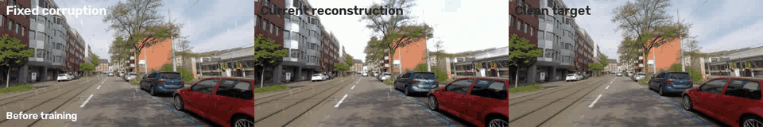
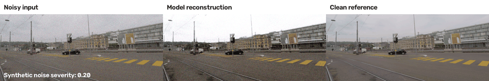
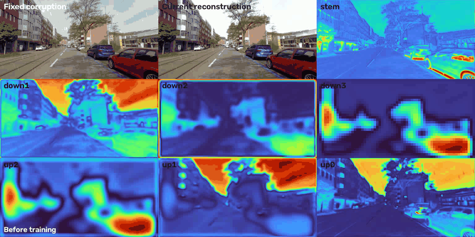
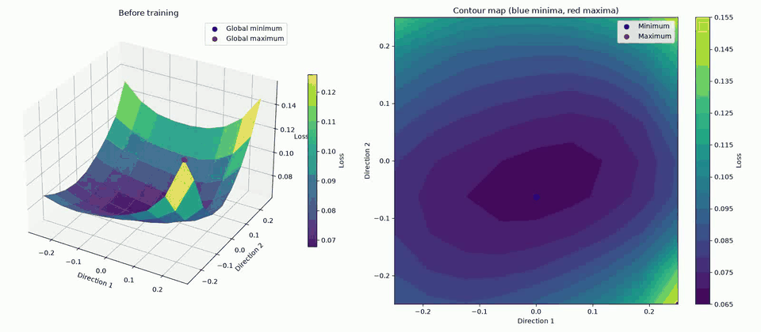

# Task-Aware Image Decorruption

Research code for testing whether a lightweight restoration front end improves semantic segmentation on adverse-condition driving images.

## Methods

- No preprocessing
- CLAHE with adaptive gamma
- Reconstruction-only decorrupter
- Task-aware decorrupter
- Task-aware decorrupter with identity and smoothness regularization

## Key Results

All segmentation results use the 406-image ACDC validation split at `256×512` resolution with the same
multi-epoch SegFormer checkpoint. The task-aware model preserves baseline performance, whereas using the
reconstruction-only model as a preprocessing step lowers mIoU in this experiment.

| Preprocessing method | mIoU | Pixel accuracy | Interpretation |
| --- | ---: | ---: | --- |
| None (SegFormer baseline) | **0.5496** | 0.9054 | Reference performance on adverse-condition images. |
| Reconstruction-only | 0.5243 | 0.8815 | Generic synthetic restoration does not transfer cleanly to segmentation. |
| Task-aware decorrupter | 0.5494 | **0.9061** | Semantic-task feedback recovers nearly all baseline mIoU. |

Restoration quality was evaluated separately on held-out ACDC clean-reference images with synthetic corruptions.

| Restoration checkpoint | PSNR ↑ | SSIM ↑ | L1 ↓ |
| --- | ---: | ---: | ---: |
| One-epoch seed | **21.1027** | 0.8330 | 0.0713 |
| Multi-epoch checkpoint | 20.8404 | **0.8409** | **0.0707** |

The multi-epoch model improves structural similarity and absolute reconstruction error, while PSNR is slightly
lower. This is consistent with the combined L1, SSIM, and smoothness training objective rather than a PSNR-only goal.

Detailed machine-readable results are available in `outputs/presentation_evaluation/` and
`outputs/presentation_restoration_evaluation/`.

## Training and Qualitative Evidence

### Reconstruction Learning

The GIF below follows one fixed synthetic corruption throughout restoration training. The left panel is the
corrupted input, the center panel is the current model reconstruction, and the right panel is the clean reference.
The status text records the training epoch, optimization step, and instantaneous loss.



### Noisy Reconstruction Stress Test

This sequence increases synthetic sensor-noise severity from `0.20` to `0.95` for the same held-out reference image.
It shows the noisy input, the trained model output, and the clean reference side by side. This is a stress test: the
model was trained on individual synthetic corruptions, so the GIF is evidence of behavior under noise rather than a
claim of perfect restoration at every severity.



### Activation Maps

The activation dashboard shows how the fixed image propagates through the residual decorrupter. `stem`, `down1`,
`down2`, and `down3` are encoder stages; `up2`, `up1`, and `up0` are decoder stages. Each heatmap is mean absolute
channel activation, so brighter regions indicate stronger feature responses.



### Local Loss Landscape

This animation samples the reconstruction loss in a two-direction local parameter-space slice around the evolving
restoration checkpoint. Purple/blue regions indicate lower sampled loss and green/yellow regions higher loss. The blue
and red markers show the sampled global minimum and maximum, respectively; these axes are parameter directions, not
image features.



## Setup

```bash
python -m venv .venv
source .venv/bin/activate
pip install --upgrade pip
pip install -e ".[dev]"
```

Install the CUDA build of PyTorch first when GPU training is required.

## Smoke test

```bash
decorrupt-smoke
pytest -q
```

## Data

Place ACDC under `data/acdc` using the structure in `docs/dataset_layout.md`.

```bash
decorrupt-validate-data --root data/acdc --split train
decorrupt-validate-data --root data/acdc --split val
```

## Training

```bash
decorrupt-train-segmenter --config configs/segmenter.yaml
decorrupt-train --config configs/restoration.yaml
decorrupt-train --config configs/task_aware.yaml
```

For the multi-epoch presentation run, continue the checked one-epoch checkpoint and save all artifacts under `outputs/presentation_restoration`:

```bash
decorrupt-train --config configs/presentation_restoration.yaml --record-learning --record-activations --record-every 100 --landscape-every 800 --activation-every 400
decorrupt-evaluate-restoration --config configs/presentation_restoration_eval.yaml --checkpoint outputs/presentation_restoration_final/best.pt
```

If a long run is interrupted, continue from its latest checkpoint with `configs/presentation_restoration_final.yaml`.

For the complete presentation pipeline, train the segmenter and then task-aware restoration:

```bash
decorrupt-train-segmenter --config configs/presentation_segmenter.yaml
decorrupt-train --config configs/presentation_task_aware.yaml
decorrupt-evaluate --config configs/presentation_evaluate.yaml --method learned --checkpoint outputs/presentation_task_aware/best.pt
```

To watch a fixed synthetic corruption improve during reconstruction training, add `--preview`. The window refreshes every 50 optimizer steps by default; press `q` or `Esc` to close the preview without stopping training.

```bash
decorrupt-train --config configs/restoration_test.yaml --preview --preview-every 25
```

To save the learning process, record a fixed reconstruction and a recentered local loss landscape throughout training. This writes `reconstruction_learning.mp4`, `loss_landscape_learning.mp4`, `post_training_reconstruction.png`, and `post_training_loss_landscape.png` to the configured output directory.

```bash
decorrupt-train --config configs/restoration_test.yaml --record-learning --record-every 25 --landscape-every 200
```

Each loss-landscape snapshot evaluates a 9x9 grid by default, so increase `--landscape-every` when training is slow.

Record the fixed image's encoder and decoder activation heatmaps throughout training:

```bash
decorrupt-train --config configs/restoration_test.yaml --record-activations --activation-every 100
```

This writes `activation_learning.mp4` to the configured output directory.

## Evaluation

```bash
decorrupt-evaluate --config configs/evaluate.yaml --method none
decorrupt-evaluate --config configs/evaluate.yaml --method classical
decorrupt-evaluate --config configs/evaluate.yaml --method learned --checkpoint outputs/restoration/best.pt
decorrupt-evaluate --config configs/evaluate.yaml --method learned --checkpoint outputs/task_aware/best.pt
decorrupt-evaluate-restoration --config configs/restoration_eval.yaml --checkpoint outputs/restoration/best.pt
decorrupt-benchmark --config configs/evaluate.yaml --method learned --checkpoint outputs/task_aware/best.pt
```

## Live Reconstruction Viewer

Display the synthetic corruption, the model output, and the clean reference side by side. Press `q` or `Esc` to stop.

```bash
decorrupt-view-reconstruction --config configs/restoration_test.yaml --checkpoint outputs/test_restoration/best.pt --loop
```

## Loss Landscape

Sample a two-direction, local loss slice around a trained checkpoint using a fixed synthetic batch. The PNG contains a 3D surface and contour map; blue markers are minima and red markers are maxima in the sampled plane.

```bash
decorrupt-plot-loss-landscape --config configs/restoration_test.yaml --checkpoint outputs/test_restoration/best.pt --resolution 21 --samples 4
```

The proposal is stored at `docs/research_proposal.docx`.
